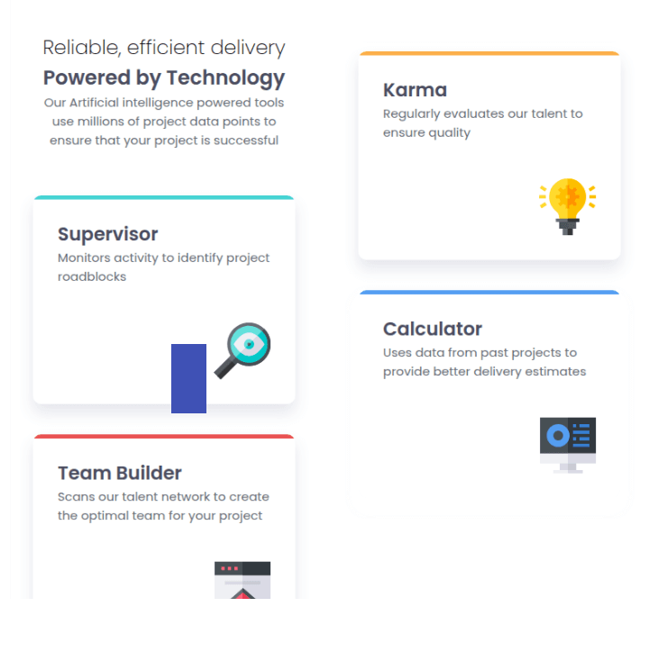
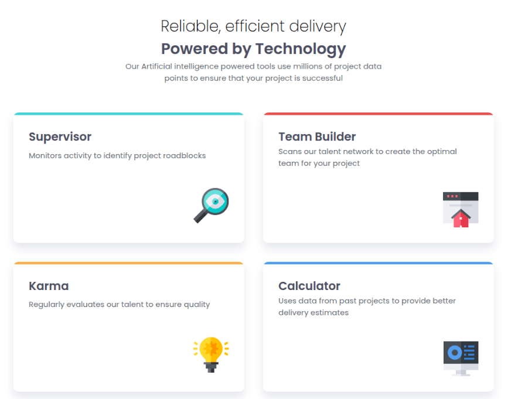
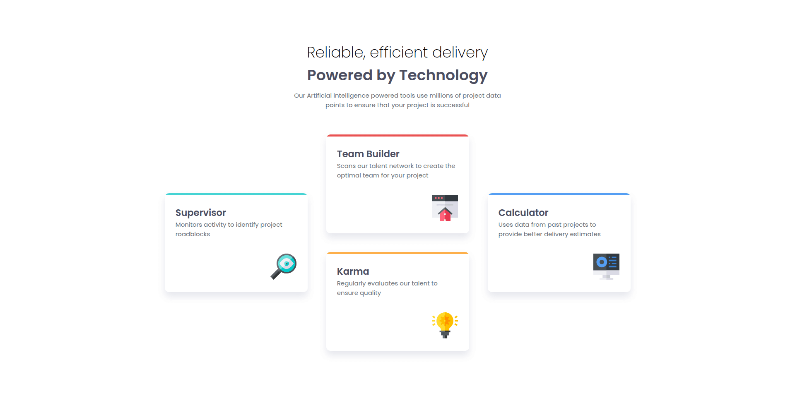

# Frontend Mentor - Four card feature section solution

This is a solution to the [Four card feature section challenge on Frontend Mentor](https://www.frontendmentor.io/challenges/four-card-feature-section-weK1eFYK). Frontend Mentor challenges help you improve your coding skills by building realistic projects.

## Table of contents

- [Overview](#overview)
  - [The challenge](#the-challenge)
  - [Screenshot](#screenshot)
  - [Links](#links)
- [My process](#my-process)
  - [Built with](#built-with)
  - [What I learned](#what-i-learned)
  - [Continued development](#continued-development)
  - [Useful resources](#useful-resources)
- [Author](#author)
- [Acknowledgments](#acknowledgments)

## Overview

### The challenge

Users should be able to:

- View the optimal layout for the site depending on their device's screen size

### Screenshots

#### --- Small Screens ---

#### --- Medium Screens ---

#### --- Large Screens ---

### Links

- Solution URL: [Repository](https://github.com/amShuri/four-card-feature-section)
- Live Site URL: [Live Site](https://amshuri.github.io/four-card-feature-section/)

## My process

### Built with

- Semantic HTML5 markup
- CSS custom properties
- Flexbox
- CSS Grid
- Mobile-first workflow

### What I learned

While I improved my understanding of Flexbox and CSS Grid — especially grid row spanning and layout grouping — my biggest takeaway here was learning how to handle breakpoints properly.

I built the layout, resized the viewport over and over using devTools, and introduced breakpoints **only** when the design visually required a change.

I also learned how to use clamp() better. This is something I keep having trouble with every time I use it, but I'm slowly getting there.

### Continued development

In the future I want to keep learning about clamp(), CSS Grid and mobile-first workflow.

## Author

- GitHub - [amShuri](https://github.com/amShuri/)
- Frontend Mentor - [@amShuri](https://www.frontendmentor.io/profile/amShuri)
- Twitter - [@amShuri7](https://www.twitter.com/amshuri7)
